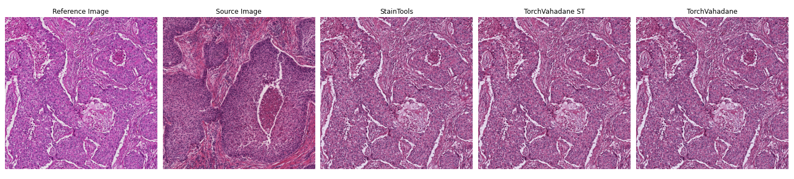

# TorchVahadane

[Vahadane stain normalization](https://ieeexplore.ieee.org/document/7460968) is being used extensively in Digital Pathology workflows to provide better generalization of Deep Learning models between cohorts.

The StainTools package has been one of the most used and most clear implementation of the Vahadane stain normalization.
Unfortunately, StainTools can be slow when used on large images or on a large number of images.

This repository implements a GPU accelerated version of the Vahadane stain normalization using torch.

This repository provides a fully GPU based stain normalization workflow, useful in combination with cuCIM and a faster workflow using CPU based stain matrix estimation with accelerated stain concentration estimation.

For WSI workflows, a fixed target stain matrix can be set, eliminating the need for recalculating the stain matrix for every new image patch and making the transformation fully GPU based.



Benchmarks using LineProfiler show speed increase of TorchVahadane compared to StainTools.

Method| fit [s] | transform  [s] | total  [s]
| :--- | :---: | :---: | :---:
**StainTools Vahadane**| 17.4 | 17.1&nbsp;&nbsp;&nbsp;&nbsp;&nbsp;&nbsp;&nbsp;  | 34.5
**TorchVahadane** | 9.4 | 8.5 [*1.5*] | 17.9
**TorchVahadane ST**| 3.2 | 3.1 [*1.5*] |  ***6.3***

Brackets indicate the transformation speed when using a fixed stain matrix (see [robust stain estimation](#robust-stain-estimation-of-whole-slide-images)). Measured using python 3.11.3 and spams 2.6.5.4. 

## Usage

TorchVahadane can be employed as a drop-in replacement for StainTools.
Per default, the TorchVahadaneNormalizer uses the cuda device and uses staintools based stain_matrix estimation (fastest and most robust approach).
As StainTools is now a read-only repository, StainTools is integrated and not used as a dependency. The transform function also has a default parameter to pass-through the generated tissue mask for downstream tasks.

```
from torchvahadane import TorchVahadaneNormalizer
normalizer = TorchVahadaneNormalizer(device='cuda', staintools_estimate=True)
normalizer.fit(target)
img_normed = normalizer.transform(img)

# return tissue mask
img_normed, img_mask = normalizer.transform(img, return_mask=True)
```

## Histogram matching

In practice, Vahadane normalization does not always transfer the saturation and contrast of the reference image to the source image, this retaining a domain shift between the target and source image.

This can be mitigated by using histogram matching (see [skimage.exposure.match_histograms](https://scikit-image.org/docs/stable/auto_examples/color_exposure/plot_histogram_matching.html)).

TorchVahadane implements masked histogram matching using torch, matching the cumulative density function of the histograms only on tissue pixels. This makes histogram matching suitable to work on histology tiles with non-tissue regions.


Histogram matching is integrated into the standard fit/transform pipeline and is enabled by setting correct_exposure to True.

```
from torchvahadane import TorchVahadaneNormalizer
normalizer = TorchVahadaneNormalizer(correct_exposure=True)
normalizer.fit(target)
normalizer.transform(img)
```
Masked histogram matching can also be used directly from the histogram_matching module.


## Robust stain estimation of Whole Slide Images
TorchVahadane also supports the estimation of median stain intensities, as proposed by Vahadane et al.
TorchVahadane samples the WSI over a grid of tiles amd returns the median stain instensities. Openslide is used as an optional dependency to extract the WSI tiles.

Setting a fixed stain_matrix skips the stain_matrix estimation of the source image in the transform, speeding up subsequent transformations.

```
from torchvahadane.wsi_util import estimate_median_matrix

stain_matrix = estimate_median_matrix(osh, normalizer, osh_level=0, tile_size=4096, num_workers=12)
normalizer.set_stain_matrix(stain_matrix)
```

## Installation
TorchVahadane can be installed with pip using

```
git clone https://github.com/cwlkr/torchvahadane.git
cd torchvahadane
pip install .
```

or directly

```
pip install git+https://github.com/cwlkr/torchvahadane.git
```


## Notes
Spams installation through pip throws more errors than not. Using conda's pre-compiled binaries might work best.
Spams is not listed in the package requirements.

Openslide is not listed in the package requirements as it is considered optional.

## Acknowledgments

Several lines of code in this repository are directly adapted from the following repositories I would like to credit with their excelent work!

[StainTools](https://github.com/Peter554/StainTools)    
[pytorch-lasso](https://github.com/rfeinman/pytorch-lasso)  
[torchstain](https://github.com/EIDOSLAB/torchstain)
